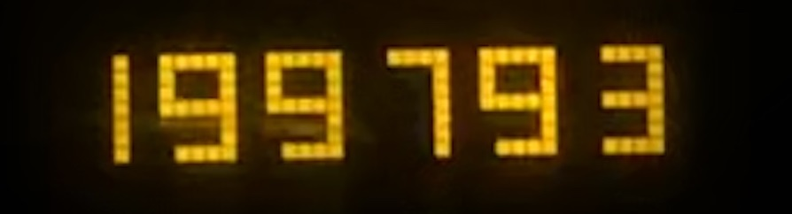
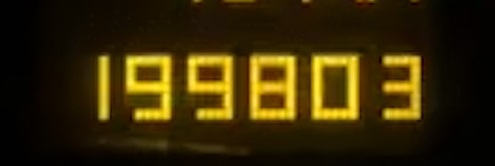

# Mileage Tracking Automation

## using scikit k-NN prediction and image metadata

### Introduction

This repository contains a set of pythons script for mileage tracking based on the odometer of the car.

With a start and end image on the odometer the digits is recognized with the help of machine learning using scikit and k-NN algorithm. A model is trained on images from the odometer for best result and achieves with an accuracy of 0.9 in most cases. Scripts for training and extracting training data is included in the repo.

Metadata from the images is used to get the date of travel and start/end location. Everything is stored to a cvs file for accounting.

### Requirements

* Python 3.x (3.7 tested)
* OpenCV
* scikit
* numpy
* imutils
* geopy
* imageio
  
### Optional

Run this script from a os scheduler for autonomous logging.

### Example 

#### Input images 





#### Processed single digits example


```python
def processImage(self):
    image = imutils.resize(self.cvImg, height=500, width=500)
    #Pre-prossesing of img
    gray = cv2.cvtColor(image, cv2.COLOR_BGR2GRAY)
    blurred = cv2.GaussianBlur(gray, (5, 5), 0)
    inv =~blurred
    thresh = cv2.threshold(inv, 0, 255,
    cv2.THRESH_BINARY_INV | cv2.THRESH_OTSU)[1]
    kernel = cv2.getStructuringElement(cv2.MORPH_ELLIPSE, (1, 5))
    thresh = cv2.morphologyEx(thresh, cv2.MORPH_OPEN, kernel)

    #Find the each number
    cnts = cv2.findContours(thresh,  
    cv2.RETR_EXTERNAL, cv2.CHAIN_APPROX_SIMPLE) 
    cnts = imutils.grab_contours(cnts)
    cnts = self.sort_contours(cnts,method="left-to-right")[0]

    for c in cnts:
        (x, y, w, h) = cv2.boundingRect(c)
        digit = thresh[y-5:y+h+5, x-5:x+w+5]
        digit = cv2.resize(digit,(50,50))
        self.digits.append(digit)
```

#### k-NN prediction

```python
df= hog(digit, orientations=8, pixels_per_cell=(10,10), cells_per_block=(5, 5))
predict = knn.predict(df.reshape(1,-1))[0]
```

#### Metadata

```python 
with open(self.path, 'rb') as image_file:
    image = Image(image_file)
    lat = str(image.gps_latitude[0] + image.gps_latitude[1]/60 + image.gps_latitude[2]/3600)
    log = str(image.gps_longitude[0] + image.gps_longitude[1]/60 + image.gps_longitude[2]/3600)
    self.cord = lat+","+log

    split = image.datetime.split()
    self.date = split[0].replace(':','-')

#######

def getLocation(image):
    adress = ''
    geolocator = Nominatim(user_agent="mileageTracker")
    location = geolocator.reverse(image.cord)
    adress = location.raw['address']['postcode'] + ', ' + location.raw['address']['city']
    return str(adress)
```

#### Result


### Training Model
Everyting about training the model is locasted in the `ml/` directory.

1. Put all original images in one directory and run:

   `python extractDigits.py path/to/folder`

   This script will iterate over all images and extract the individual digits so the user can press corresponding number on the keyboard for every digit that pop-up.

2. Once done, the user will have a new directory named dataSet with subfolders for every digit type e.g.
   
   `dataSet/2`

3. Create a folder for the model and run:
   
   `python train.py`

4. Test the result with `predict.py`


### TO-DO

* Extend dataset with more images for improved performace
* Verify metadata from different types of cameras and os (iPhone verified)
* Clean-up code and optimize solution
* Handle images with alot of noice
